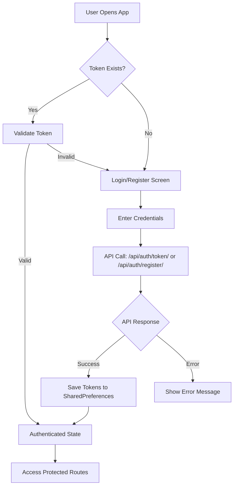
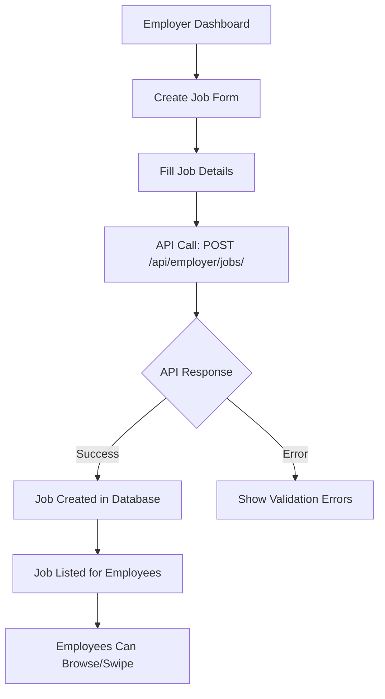
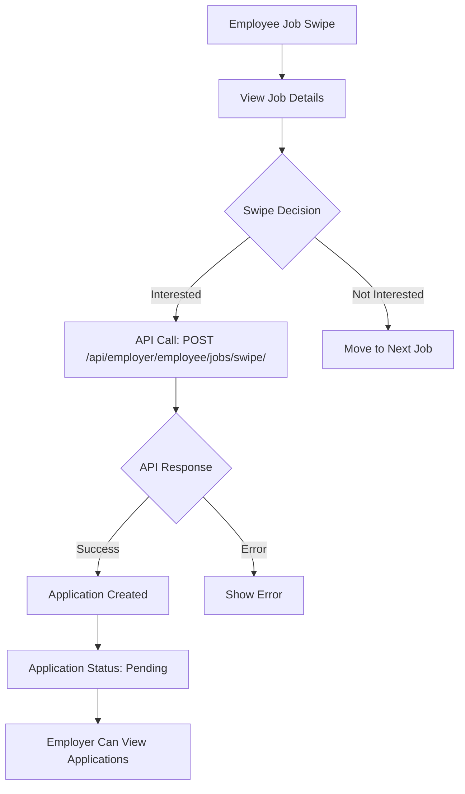
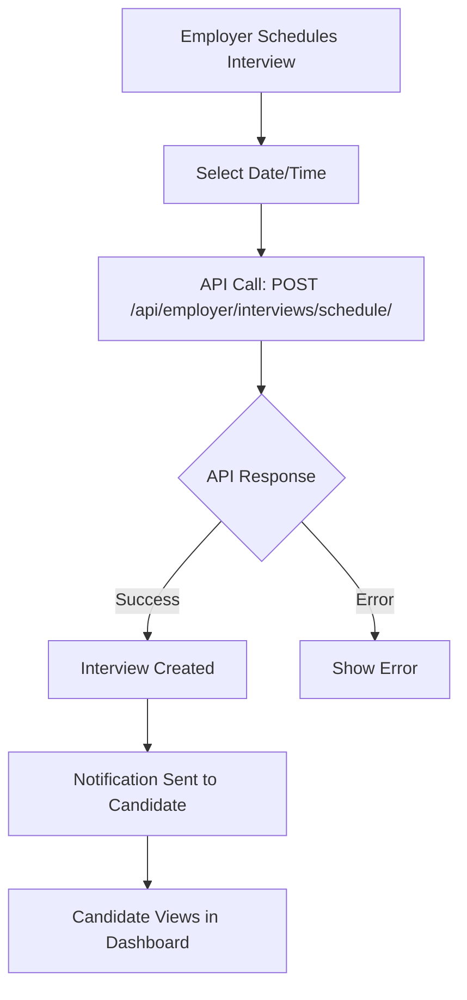
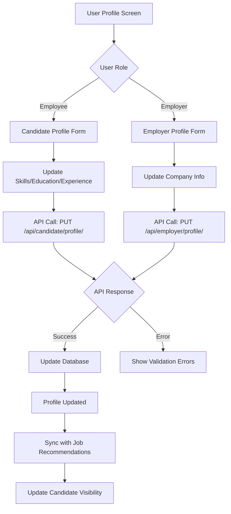
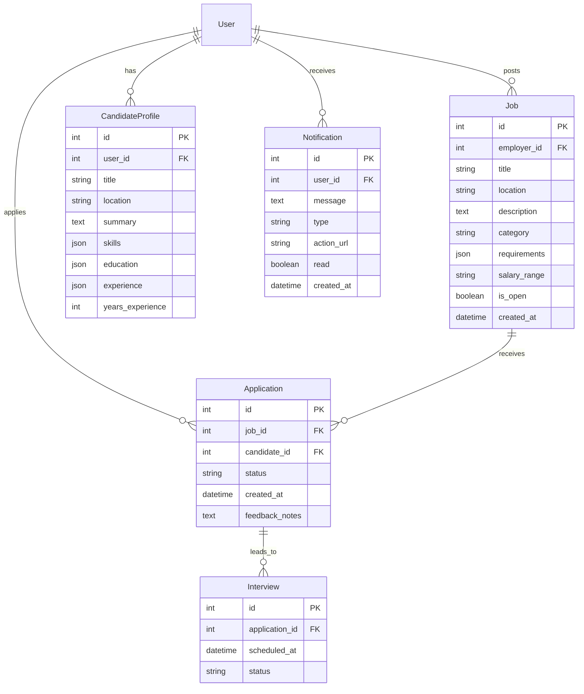

# Mabasa Job Application Platform - Data Flow Diagram

## Overview
This document provides a comprehensive data flow diagram for the Mabasa job application platform, which consists of a Flutter mobile app (MabasaFlutter) and a Django REST API backend (mabasa_backend). The platform supports two main user roles: Employers and Employees (Candidates).

## Architecture Components

### Frontend (Flutter App)
- **Authentication Module**: Login, registration, password reset
- **Employee Features**: Job browsing/swipe, applications, profile management
- **Employer Features**: Job posting, candidate management, interviews, shortlisting
- **Core Services**: API client, authentication service, notification service

### Backend (Django REST API)
- **Authentication App**: User management, JWT tokens
- **Recruitment App**: Jobs, applications, candidates, interviews, notifications
- **Database**: SQLite (development), PostgreSQL (production)

### External Systems
- **Firebase**: Push notifications, authentication (optional)
- **File Storage**: Resume uploads, profile images
- **Email Service**: Password reset, notifications

## Data Flow Diagrams

### 1. User Authentication Flow



### 2. Job Posting Flow (Employer)



### 3. Job Application Flow (Employee)



### 4. Application Management Flow (Employer)

```mermaid
graph TD
    A[Employer Views Job Applications] --> B[API Call: GET /api/employer/jobs/{job_id}/applicants/]
    B --> C[Display Candidate List]
    C --> D[Select Candidate]
    D --> E{Action}
    E -->|Shortlist| F[API Call: POST /api/employer/jobs/{job_id}/applicants/swipe/]
    E -->|Reject| G[Update Status to Rejected]
    E -->|Interview| H[Schedule Interview]

    F --> I[Status: Shortlisted]
    G --> J[Status: Rejected]
    H --> K[Create Interview Record]
```

### 5. Interview Scheduling Flow



### 6. Notification System Flow

```mermaid
graph TD
    A[Event Occurs] --> B{Event Type}
    B -->|Application Received| C[Create Notification Record]
    B -->|Interview Scheduled| D[Create Notification Record]
    B -->|Status Update| E[Create Notification Record]

    C --> F[API Call: POST /api/notifications/]
    D --> F
    E --> F

    F --> G[Store in Database]
    G --> H[Push Notification to Device]
    H --> I[User Views in App]
    I --> J[Mark as Read: PATCH /api/notifications/{id}/read/]
```

### 7. Profile Management Flow



## Database Schema Relationships



## API Endpoints Summary

### Authentication
- `POST /api/auth/token/` - Login
- `POST /api/auth/register/` - Register
- `GET /api/auth/me/` - Get current user
- `POST /api/auth/forgot-password/` - Password reset

### Jobs (Employer)
- `GET/POST /api/employer/jobs/` - List/Create jobs
- `PUT/DELETE /api/employer/jobs/{id}/` - Update/Delete job
- `GET /api/employer/jobs/{id}/applicants/` - View applicants
- `POST /api/employer/jobs/{id}/applicants/swipe/` - Update application status

### Candidates (Employer)
- `GET /api/employer/candidates/recommended/` - Browse candidates
- `POST /api/employer/candidates/swipe/` - Shortlist candidate
- `GET /api/employer/shortlist/` - View shortlisted candidates
- `DELETE /api/employer/shortlist/{id}/` - Remove from shortlist

### Interviews (Employer)
- `GET /api/employer/interviews/` - List interviews
- `POST /api/employer/interviews/schedule/` - Schedule interview

### Jobs (Employee)
- `GET /api/employer/employee/jobs/recommended/` - Browse jobs
- `POST /api/employer/employee/jobs/swipe/` - Apply to job
- `GET /api/employer/employee/applications/` - View applications
- `DELETE /api/employer/employee/applications/{id}/` - Delete application
- `POST /api/employer/employee/applications/reapply/` - Reapply to job

### Notifications
- `GET /api/notifications/` - List notifications
- `PATCH /api/notifications/{id}/read/` - Mark as read
- `DELETE /api/notifications/{id}/` - Delete notification
- `POST /api/notifications/mark-all-read/` - Mark all as read

## Data Storage and Caching

### Client-Side Storage
- **SharedPreferences**: JWT tokens, user role, basic settings
- **Local Database**: Job cache, offline applications (future feature)
- **Image Cache**: Profile pictures, company logos
- **Offline Queue**: Failed requests for retry when online

### Server-Side Storage
- **Primary Database**: SQLite (dev) / PostgreSQL (prod) - All application data
- **File Storage**: AWS S3 / Cloudinary for resume uploads, profile images
- **Cache Layer**: Redis for session data, API response caching, user sessions
- **Search Index**: Elasticsearch for job/candidate search functionality

### Caching Strategy
- **API Response Cache**: 5-15 minute TTL for job listings, candidate profiles
- **Static Assets**: CDN caching for images, CSS, JS files
- **Database Query Cache**: Redis caching for frequently accessed data
- **Session Cache**: User authentication state, preferences

## Security Considerations

### Authentication & Authorization
- JWT tokens with refresh mechanism and expiration
- Role-based access control (Employee vs Employer)
- Token validation on all protected endpoints
- Multi-factor authentication (future enhancement)
- Session management with secure cookies

### Data Protection
- Password hashing using bcrypt/PBKDF2
- HTTPS/TLS 1.3 for all API communications
- Input validation and sanitization on all endpoints
- SQL injection prevention through Django ORM
- XSS protection with Content Security Policy
- CSRF protection on state-changing operations

### Privacy & Compliance
- User data encryption at rest using database encryption
- GDPR compliance for EU users (data portability, right to erasure)
- Secure file upload handling with virus scanning
- Data retention policies for deleted accounts
- Audit logging for sensitive operations

### Network Security
- Rate limiting on API endpoints
- IP-based blocking for suspicious activity
- API key authentication for mobile app
- CORS configuration for cross-origin requests
- Security headers (HSTS, X-Frame-Options, etc.)

## Performance Optimizations

### Database
- Indexing on frequently queried fields
- Pagination for large result sets
- Select related queries to minimize N+1 problems

### API
- Response caching
- Database query optimization
- Background job processing for heavy operations

### Mobile App
- Lazy loading of job lists
- Image caching
- Offline capability for critical features

## Monitoring and Logging

### Backend
- API request/response logging
- Error tracking and alerting
- Performance monitoring
- Database query monitoring

### Frontend
- Crash reporting
- User analytics
- Performance metrics
- Network request monitoring

This data flow diagram provides a comprehensive overview of how data moves through the Mabasa platform, from user interactions to database persistence and back to the user interface.